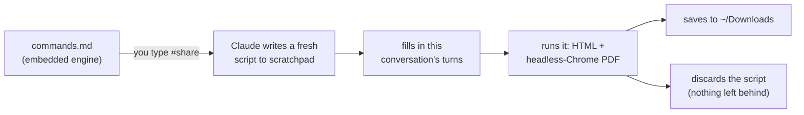

# Claude Code — memory file examples

Two real (sanitized) examples of the **file-based memory** that
[Claude Code](https://claude.com/claude-code) can keep per user — plus an explanation of how the
memory system works and how to adapt these files for yourself.

Personal details have been replaced with placeholders, mainly `[name]` and generic paths.

---

## What is Claude Code memory?

Claude Code can keep a persistent, file-based memory that survives across sessions. It lives in a
folder like:

```
~/.claude/projects/<project-slug>/memory/
```

Inside that folder there are two kinds of thing:

- **`MEMORY.md`** — a lightweight **index**: one line per memory file. This index is loaded into
  context at the start of **every** session, so Claude always knows *what* memories exist (without
  paying to load them all).
- **One `.md` file per topic** — the actual content. These are read **on demand**, only when the
  topic is relevant, which keeps the per-turn token cost low.

Each memory file begins with YAML frontmatter:

```markdown
---
name: <short-kebab-case-slug>
description: <one-line summary used to decide relevance during recall>
metadata:
  type: user | feedback | project | reference
created: YYYY-MM-DD
---

<the fact / instructions. Cross-link related memories with [[their-name]].>
```

The `type` field roughly means:

| type | meaning |
| --- | --- |
| `user` | who you are (role, preferences, background) |
| `feedback` | how you want Claude to work |
| `project` | ongoing work, goals, constraints |
| `reference` | pointers to resources — or, as here, a reusable procedure |

`[[double-bracket]]` tokens cross-link one memory to another by its `name`.

---

## The two files

### `working-preferences.md` · type `feedback`

Response-style rules: language, tone, answer depth, formatting, and meta-rules about how Claude
manages memory itself (e.g. "announce when you edit a memory file", "don't create duplicate
files"). This one is meant to be **always on** — in the original setup it is injected into context
every turn, so every reply follows it without the file having to be re-read.

### `commands.md` · type `reference`

Defines custom **hashtag commands** — short tokens you can type inside any prompt to trigger a
predefined behavior:

| command | what it does |
| --- | --- |
| `#disable memory` / `#enable memory` | temporarily ignore all memory (e.g. when asking on behalf of someone else), then restore it |
| `#report` | print a token-cost report of every memory file |
| `#backup` | snapshot the whole memory folder via a backup script |
| `#share <format> [with/without N]` | export the current conversation to a self-contained HTML/PDF |

Most of these "commands" are **not code** — they are just natural-language instructions that Claude
recognizes and follows. No plugin, no config change: Claude reads the memory file and acts on it.
`#share` is the exception (see below).

---

## Why is there a whole script inside `#share`?

`#share` is the one command that runs **actual code** — it renders the conversation to HTML and
drives headless Chrome to produce a PDF. The full Python engine is embedded, verbatim, inside the
memory file. That looks strange for a "memory note", so here is the reasoning:

1. **Memory files are instructions, not an installed program.** There is no package to
   `pip install` and no repo to clone. The only durable place this procedure can live is the memory
   file itself.

2. **It used to depend on an external file — and that was fragile.** An earlier version pointed
   `#share` at a "reference implementation" script sitting in an *unrelated* project folder. That
   coupled a general-purpose command to one random project: move or delete that folder and `#share`
   silently breaks.

3. **Embedding makes the command self-contained.** By pasting the complete, known-good engine into
   the memory file, the command depends on nothing external. Each time `#share` runs, Claude:
   1. writes a fresh copy of the embedded script into the session's scratchpad (a temp dir),
   2. fills in *this* conversation's data,
   3. runs it to produce the file in `~/Downloads`,
   4. discards the script — nothing is left behind in any project folder.

4. **Why embed the code instead of just describing it?** The script has correctness-sensitive
   details: single-page PDF pagination, print-color CSS, base64 image embedding, and
   turn-include/exclude logic. Re-deriving all of that from a prose description on every run would
   drift and break. Storing the exact code makes the memory file the **single source of truth**, so
   every export comes out consistent.

In short, it is a **"memory-as-template" pattern**: the prose explains *when and how* to run it; the
embedded code guarantees *exactly what* runs.



---

## How to use these files yourself

1. **Find your memory folder** — typically `~/.claude/projects/<project-slug>/memory/`. If you do
   not have one yet, create the folder and an empty `MEMORY.md`.
2. **Copy in the file(s)** you want.
3. **Replace the placeholders** — swap every `[name]` for your own, and fix the machine-specific
   paths in `commands.md` (the `#backup` script path and the scratchpad path) to match your system.
4. **Register each file in `MEMORY.md`** with a one-line pointer, for example:
   ```
   - [Commands](commands.md) — hashtag commands you can type in a prompt
   ```
5. **Decide how `working-preferences.md` loads.** In the original setup it loads every turn; at
   minimum, listing it in `MEMORY.md` makes Claude aware of it and read it early in a session.
6. **Start a fresh session and test** — e.g. type `#report`, or check that your response-style rules
   are being applied.

---

## Notes & caveats

- These are one person's customizations. Treat them as a **starting point**, not a spec — adapt the
  rules and commands to your own workflow.
- Some behaviors depend on the harness/version — for example the `#disable memory` note about the
  index being pre-loaded before a turn, and the auto-loading of `working-preferences.md`. Your setup
  may differ.
- Everything here is sanitized: no real names, emails, or private paths.
